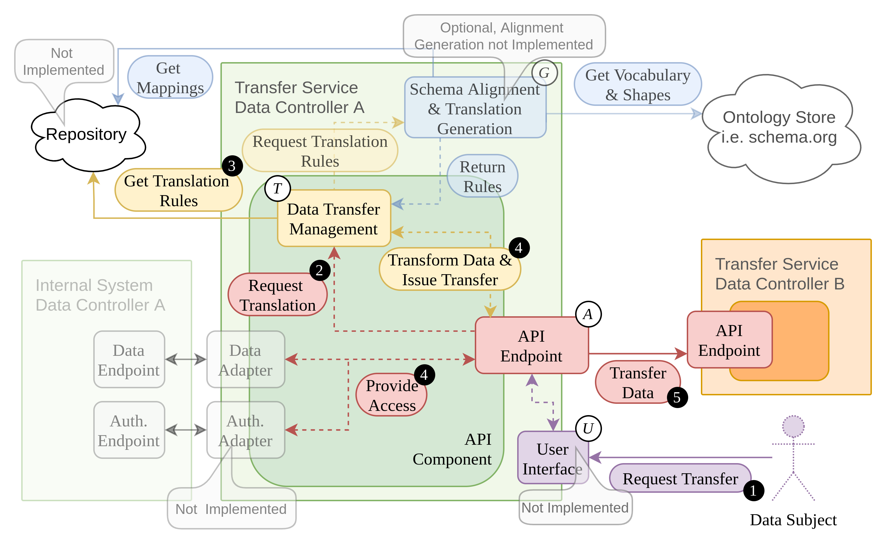

# Transfer Service
<!--
Introduction
-->
To facilitate personal data transfers, the data transfer service provides a concept for a future data portability framework. 
Data portability describes the transfer of user (data subject) data from a source data controller (e.g. Twitter) to a target data controller (e.g. a Mastodon Host). The concept aims to allow a broad range of Controllers to participate, while minimizing the effort needed to enable translations with a new Controller. To archive this goal, an architecture relying on semantic schema annotations of the source and target data schemas was explored and partially implemented.

This repository contains an early prototype implementation for a data transfer service (TS). The prototype was created as part of the bachelor thesis ["Semantic Schema Annotations for Portability of Personal Data"](https://github.com/overflw/BA-Latex).

## Setup 

The `ts-core-api` and `ts-config-gen` modules interact with a mongoDB instance. For both modules a docker-compose file was created, which builds the python application and connects it with a db. Both can also be build and executed directly as python applications. In this case the mongoDB connection must be specified via a `.env` file found in the respective top-level directory.

<!-- 
### Docker-compose 
-->
```sh
docker-compose -f ts-core-api/docker-compose.yml up  -d && 
docker-compose -f ts-config-gen/docker-compose.yml up -d
```


## Concept
To realize the vision of a portability system which is flexible enough to support a wide range of Controllers, while keeping the integration effort low, we use a semantic schema annotation approach for the underlying data translation problem. The concept consists of the following steps:
1. Modeling. When using semantic annotation for data translation, the first step is to model the source and target data schema in RDF. In other words, linking data schema elements with semantically fitting concepts in a vocabulary like schema.org and formalize the link in a mapping file (see [RML](https://rml.io/)). The resulting mapping information can be applied to a source data set to retrieve an RDF graph representation, which is processed in the following steps.
2. Schema Matching. Schema matching systems processing RDF are used to find an alignment between the source and target RDF graphs. In our case an alignment expresses tuples of semantically equivalent source and target RDF entities.
3. Translation Rule Generation. The alignment found between source and target schema is used together with data type information from the RDF-graphs to generate translation rules. These transform the source data into target data when applied.
4. Translation. When applying the transformation rules on the source data, the source plain-data instances are directly translated to the target-data format.

<!-- 
Include direct translation part from Präsi
-->


For a detailed description of the concept please see the corresponding thesis chapter 4.

## Architecture

At its core a TS consists of an API endpoint _A_; a data transfer management module _T_; and a translation generation module _G_. A transfer flow between two data controllers starts with a data subject submitting a request for a data transfer (1) via the API-endpoint. A transfer request must contain the source and target data controller URL and supply the corresponding authentication tokens. The request is passed on to _T_ via the API (2). _T_ can either query the required transformation from an external repository or from a local generation module _G_. Local rule generation requires mapping information to and from RDF for both data controllers. These mapping files are either queried from a repository or are provided by the corresponding controller. The retrieved translation configuration is applied to the source data accessed via the API (4) and finally, the transformed data are transferred to the target endpoint (5). The transfer service architecture was inspired by the [DTP](datatransferproject.dev/). 

<!-- 
Include architecture overview
-->


As the implementation at hand is an early prototype, it still misses core elements of the envisioned architecture. E.g. the translation generation module lacks schema matching capabilities and the prototype only supports JSON input and output data.

See thesis chapter 5 for a detailed documentation of the architecture and the technologies used in the prototype.

## Directory Structure

The API and translation management module is found in the `ts-core-api` folder and the translation configuration generation module in `ts-config-gen`. Both modules use a similar structure: the fastAPI based python application is found in the `app` folder.
The project is organized according to the structure proposed in the [fastAPI documentation](https://fastapi.tiangolo.com/):
- `core` contains a `config.py` file which reads configuration parameters from `.env`. This is mainly used for database access.
- `crud` specifies a `CRUDBase` class which offers operations on the mongoDB database. The base class is used to instantiate a CRUD class for every mongoDB collection.
- `db` contains mongoDB specific utility functions.
- `models` includes the data models expected, like a transfer job object or a translation config file. Models are implemented via [pydantic](https://pydantic-docs.helpmanual.io/). 
- `routers` describes the API endpoints available and the logic connected to them.
- `translator` is specific to the `ts-core-api` module and integrates the [glom](https://github.com/mahmoud/glom) and [SPARQL-GENERATE](https://w3id.org/sparql-generate/) transformation libraries.
- `data_transfer` is also specific to `ts-core-api` and implements the transfer of translated data.
- `config_gen` is part of the `ts-config-gen` module and contains the data translation logic.

Further, the `ts-core-api` and `ts-config-gen` folders include a respective `api_db` and `config_gen_db` directory which contains configuration files read by the mongoDB docker container.

Finally, we implemented simple [pytest](https://docs.pytest.org) based test cases in the `tests` subfolder. The `ts-config-gen/tests/test_glom_config_gen.py` contains the benchmarking setup used in the thesis in chapter 6.4.
